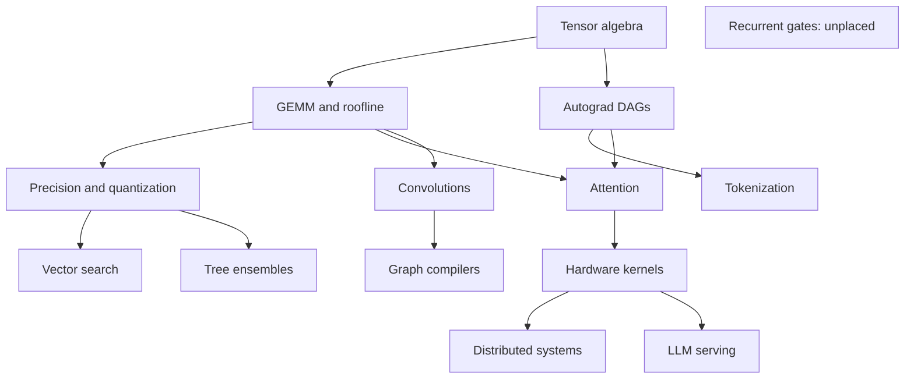

# Current State and Gap Analysis

## Scope and method

This audit inspected:

- the canonical ML topic entries in `src/curriculum/topics.ts`;
- the ML tree placements and prerequisites in
  `src/components/knowledge-graph/mlInfraTree.ts`;
- all algorithm definitions enrolled by `src/algorithms/registry.ts`;
- each ML-bound definition's topic memberships, difficulty, examples, trivia,
  source metadata, code, and generator behavior; and
- representative definitions for duplicated or technically questionable
  groups.

Counts in this document refer to unique enrolled algorithm definitions unless a
table explicitly says "topic memberships." A definition can belong to more than
one topic, so membership totals are larger than unique-definition totals.

## Inventory

- 14 canonical `ml-infra` topic IDs.
- 13 tree placements.
- 232 unique ML-bound algorithm definitions.
- 306 ML-topic memberships.
- 176 definitions have more than one `topicId`.
- 74 definitions bind to exactly two ML topics.
- 102 definitions also bind to a DSA topic.
- 54 Easy, 92 Medium, and 86 Hard definitions.
- 67 definitions have only one authored example.
- 189 definitions have trivia metadata.
- 232 of 232 definitions have a source entry, but 0 have a source URL.

The missing placement is `ml_recurrent_gates`. Its two Hard definitions are
enrolled and filterable but cannot be reached as a node in the ML tree.

## Current nodes and load

| Topic | Placement | Easy | Medium | Hard | Total |
| --- | --- | ---: | ---: | ---: | ---: |
| Tensor Algebra & Memory Strides | Root | 9 | 14 | 4 | 27 |
| GEMM & Roofline Model | Placed | 10 | 16 | 20 | 46 |
| Autograd & Computational Graphs | Placed | 3 | 12 | 5 | 20 |
| Precision Math & Quantization | Placed | 6 | 9 | 7 | 22 |
| Vector Search & Spatial Indexing | Placed | 5 | 8 | 7 | 20 |
| Subword Tokenization & Tries | Placed | 4 | 4 | 11 | 19 |
| Tree Ensembles & XGBoost | Placed | 6 | 4 | 7 | 17 |
| Convolutional Tiling & im2col | Placed | 4 | 13 | 1 | 18 |
| Recurrent Gates & Sequences | **Unplaced** | 0 | 0 | 2 | 2 |
| Attention Geometry & KV-Cache | Placed | 8 | 14 | 9 | 31 |
| Hardware Kernels & GPU SRAM | Placed | 3 | 11 | 21 | 35 |
| Model Compression & Compilers | Placed | 0 | 0 | 4 | 4 |
| Distributed ML & Interconnects | Placed | 4 | 9 | 7 | 20 |
| LLM Serving & Continuous Batching | Placed | 5 | 10 | 10 | 25 |

The largest topic has 46 memberships while the smallest has 2. The shape is
not a progression of comparable learning units; it is an uneven index of
available algorithm files.

## Current prerequisite graph

The placed graph is connected and acyclic, but graph validity is not the same
as pedagogical validity.

### Prerequisite problems

- Tokenization does not require autograd.
- Tree ensembles do not require quantization.
- Approximate nearest-neighbor systems do not generally require quantization
  before exact search, embeddings, similarity metrics, or retrieval evaluation.
- Graph capture, operator fusion, and IR lowering are broader than
  convolutional lowering.
- Distributed training requires training-loop and communication-model
  knowledge; it is not downstream only of GPU kernel programming.
- LLM serving requires inference and serving fundamentals, transformer/KV-cache
  knowledge, capacity modeling, and reliability. Custom hardware kernels are an
  optimization, not a universal prerequisite.
- Recurrent gates are an isolated content island.

## What the current curriculum actually teaches

The current track covers these areas well or at least extensively:

- tensor indexing, shape mechanics, strides, layouts, and contiguity;
- matrix multiplication, tiling, cache/SRAM reuse, and roofline reasoning;
- small computational graphs, reverse-mode autodiff, VJPs, and checkpointing;
- floating-point representations, softmax stability, and quantization;
- ANN/vector-index mechanics;
- tokenization data structures and algorithms;
- selected tree, convolution, recurrent, and attention internals;
- GPU-oriented tiling, FlashAttention, and Triton-inspired ideas;
- collective communication and model-parallelism mechanics;
- selected compiler/fusion ideas; and
- KV paging, continuous batching, and speculative decoding.

This is closer to an **advanced model-runtime and performance algorithms
collection** than an **ML infrastructure engineering curriculum**.

## Missing production competencies

The following are either absent or not first-class topics:

| Competency | Why an ML infrastructure engineer needs it |
| --- | --- |
| ML problem framing | Prevents building a technically correct system for the wrong target or feedback loop. |
| Labels, sampling, splits, and leakage | Training data is versioned time-dependent evidence, not a static application table. |
| Baselines, evaluation, calibration, and slices | A service can be healthy while the model is wrong for important cohorts. |
| Data validation and contracts | Schema, distribution, freshness, and semantic changes break models differently from ordinary API changes. |
| Dataset, feature, and artifact lineage | Reproduction and rollback require exact code/data/config/environment ancestry. |
| Feature stores and point-in-time correctness | Online freshness and historical correctness must coexist without leakage. |
| Experiment tracking and reproducibility | Model selection is an evidence-management problem, not just a build output. |
| Workflow orchestration and ML testing | Retries, caching, backfills, nondeterminism, and data tests create ML-specific failure modes. |
| Training platform and scheduling | Compute requests, quotas, checkpoints, preemption, and data locality drive reliability and cost. |
| Model packaging and registry promotion | An artifact needs signature, preprocessing, dependencies, compatibility, lineage, and release state. |
| Batch/online inference design | Freshness, throughput, tail latency, and cost change the correct topology. |
| Rollout, rollback, and serving reliability | Model and data compatibility add failure modes beyond ordinary stateless services. |
| Production evaluation and drift | Service metrics, feature health, model quality, and business outcome have different clocks. |
| Feedback loops and incident response | Retraining can amplify bad data or delayed labels; rollback is not always enough. |
| Security, privacy, governance, and cost | Training data, feature access, artifacts, and inference endpoints expand the threat and compliance surface. |

Production guidance from Google, AWS, Stanford's CS329S, Full Stack Deep
Learning, and the Google Professional ML Engineer role blueprint all give these
lifecycle concerns substantial weight. See [sources.md](sources.md).

## Problem-bank quality findings

### Duplication

Confirmed exact or near-duplicate pairs include:

- `ivf-pq-adc-search` and
  `ivf-pq-asymmetric-distance-computation`;
- `matrix-multiplication-naive` and `naive-3-loop-matmul`;
- `transpose-square-matrix` and `transpose-matrix-square`;
- `flatten-2d-grid` and `flatten-2d-array`; and
- `grouped-query-attention` and
  `grouped-query-attention-gqa-engine`.

Representative repository anchors:

| Finding | Files |
| --- | --- |
| IVF-PQ ADC duplicate | `src/algorithms/ml_infra/ivfPqAdcSearch.ts`; `src/algorithms/ml_vector_search/ivfPqAsymmetricDistanceComputation.ts` |
| Naïve matmul duplicate | `src/algorithms/ml_infra/matrixMultiplicationNaive.ts`; `src/algorithms/ml_gemm_roofline/naive3LoopMatmul.ts` |
| Transpose duplicate | `src/algorithms/ml_tensor_algebra/transposeSquareMatrix.ts`; `src/algorithms/ml_gemm_roofline/transposeMatrixSquare.ts` |
| Flatten duplicate | `src/algorithms/ml_tensor_algebra/flatten2dGrid.ts`; `src/algorithms/ml_gemm_roofline/flatten2dArray.ts` |
| GQA duplicate | `src/algorithms/ml_infra/groupedQueryAttention.ts`; `src/algorithms/ml_attention_geometry/groupedQueryAttentionGqaEngine.ts` |
| Contiguity claim to correct | `src/algorithms/ml_tensor_algebra/tensorContiguityVerifier.ts` |
| Fixed NCCL threshold to remove | `src/algorithms/ml_distributed_systems/ncclTreeVsRingAllreduceSimulator.ts` |
| Misleading custom-op implementation | `src/algorithms/ml_llm_serving/pytorchCustomCudaOpWrapperRegister.ts` |

There are larger fragmented families around GEMM baselines, HNSW operations,
IVF/PQ stages, tokenizers, quantizers, attention variants, FlashAttention,
collectives, ZeRO stages, and serving-scheduler components. Separate
implementation fragments are often useful reference material, but they should
not each count as an independent curriculum milestone.

### DSA leakage

Many definitions use cross-topic membership to place generic array, heap, trie,
graph, linked-list, interval, or range-query exercises into ML topics. Reuse is
desirable when the exercise makes an ML-system invariant concrete. It is not
desirable when an ML-flavored title is the only connection.

For the target learner, DSA should be a visible optional prerequisite or a
short just-in-time refresher. It should not silently inflate evidence of ML
competence.

### Simulation fidelity

Several definitions use names associated with CUDA, Triton, PyTorch, NCCL,
TensorRT, TVM, XLA, or production systems while executing small sequential
Python simulations. Simulations can teach invariants, but the title,
description, claims, and assessment must clearly state their abstraction
boundary.

High-priority corrections:

1. The tensor-contiguity material should not imply that all kernels require
   C-contiguous input or that non-contiguity generally causes corruption. Many
   tensor operators support strided views; individual operation contracts
   decide compatibility.
2. A fixed universal NCCL ring/tree switch threshold should not be taught.
   Selection depends on topology, protocol, architecture, message size, and
   library autotuning.
3. The PyTorch custom CUDA operation exercise does not actually register or
   invoke a PyTorch/CUDA operation. It should be removed or replaced with an
   authentic `torch.library`-based lab.
4. Triton-branded exercises should either become real Triton kernels with
   correctness and benchmark checks or be retitled as hardware-independent
   tiling simulations.
5. PagedAttention memory-efficiency claims should be scoped to the design and
   workload assumptions rather than described as universally eliminating KV
   waste.

### Difficulty

The current Easy/Medium/Hard distribution is top-heavy: 86 of 232 definitions
are Hard. Several `Hard` items are short, direct computations or simulations.
Lines of code are not a difficulty metric, but very small solutions combined
with prestigious system names are a warning that the title may be setting the
label.

Difficulty should be assigned from observable task demands. The proposed
rubric is in [assessment-design.md](assessment-design.md).

### Sources

The type system permits source URLs, but none of the ML-bound source entries
uses one. Generic labels such as "ML Infra Level N" cannot support factual
review, content updates, or learner follow-up.

Each retained item should cite at least:

- one authoritative concept or system source;
- one source for any quantitative formula or performance claim; and
- when a branded system is named, the relevant primary paper or official
  documentation.

## Strengths to preserve

- Canonical topic ownership in `TOPIC_CATALOG`.
- Required, non-empty, equal-semantics `topicIds`.
- One registry enrollment per definition using canonical kebab-case IDs.
- Derived problem counts and drawer contents.
- Data-only curriculum placements.
- Step generators and visual workspaces that can expose state evolution.
- A trivia engine derived from canonical algorithm code.
- Existing visual mechanics for strides, tiling, graphs, quantization,
  collectives, KV paging, and scheduling.

The redesign should change the teaching model without undoing these catalog
contracts.
