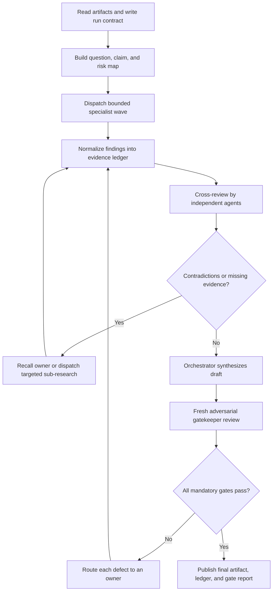

# Iterative Multi-Agent Research and Evaluation Protocol

## Purpose

Use this protocol to turn a complex task into an evidence-backed result through
specialized agents, independent review, targeted re-research, revision, and a
final gate.

This is both:

- the operating guide for the next ML-infrastructure curriculum research pass;
  and
- a reusable, skill-compatible workflow for future research, evaluation,
  planning, migration, architecture, debugging, or implementation tasks.

The core rule is:

> Do not run a one-pass agent swarm. Build a claim map, assign bounded owners,
> review every material output, return feedback to the owner, and repeat until
> the result passes explicit gates or is honestly marked blocked.

## How to invoke it

Give the orchestrator this file, the artifacts under evaluation, the user’s
goal, and the requested output location. Then say:

```text
Use iterative-multi-agent-evaluation. Run the task through its complete
contract, specialist, cross-review, revision, synthesis, and final-gate
workflow. Preserve source artifacts. Do not stop after the first agent fan-out.
```

For the present curriculum task, provide at least:

1. [`README.md`](README.md)
2. [`ORCHESTRATED-MASTER-CURRICULUM-V2.md`](ORCHESTRATED-MASTER-CURRICULUM-V2.md)
3. [`CURRICULUM-EVALUATION-V2.md`](CURRICULUM-EVALUATION-V2.md)

The feedback document is not a substitute for the proposal it evaluates. The
orchestrator and relevant specialists must inspect both.

## What this protocol prevents

Do not:

- ask ten agents to “review the whole thing” with identical prompts;
- create one agent per heading merely because headings are easy to count;
- accept first-round summaries as the final result;
- use majority vote as a substitute for evidence;
- let an author be the only reviewer of its own work;
- hide contradictions during synthesis;
- create new agents when recalling the original owner would preserve useful
  context;
- let recursively spawned agents broaden the task;
- count articles, concepts, and problem specifications as interchangeable
  artifacts;
- overwrite the source artifact during research; or
- call a result complete while critical findings remain unresolved.

## Operating principles

1. **Artifact first.** Inspect the real source files before forming tasks.
2. **Decompose by decision and risk.** Agent boundaries follow expertise,
   evidence type, and dependencies—not arbitrary equal slices.
3. **Separate creation from approval.** Every material output has an owner and
   a different reviewer.
4. **Use waves.** Parallelize independent work, then synchronize, critique,
   repair, and re-check.
5. **Preserve traceability.** Every final decision points to evidence,
   derivation, or an explicitly recorded judgment.
6. **Keep dissent visible.** Resolve disagreements or retain them as named
   uncertainties; do not average them away.
7. **Recall before replacing.** Send findings back to the responsible agent
   for a revision when its context remains useful.
8. **Escalate narrow uncertainties.** Spawn a targeted specialist or child
   agent only for a specific unresolved claim.
9. **Use fresh validation.** The final gatekeeper receives the artifacts,
   rubric, and draft—not a prompt that reveals the desired verdict.
10. **Stop on evidence, not fatigue.** Finish only when gates pass or when the
    remaining blocker is explicitly documented.

## Workflow



The arrows back to the evidence ledger are mandatory. A first fan-out followed
immediately by synthesis is not this protocol.

## Phase 0 — Establish the run contract

The orchestrator must read all controlling instructions and required source
artifacts itself before delegation.

Write a short run contract containing:

- objective;
- user outcome;
- authoritative input artifacts;
- artifacts that may be changed;
- explicit exclusions;
- decisions the run must make;
- deliverables and locations;
- evidence standard;
- known constraints;
- high-risk claims;
- success gates; and
- actions requiring additional authorization.

### Orchestrator self-questions

Before spawning any agent, ask:

- What outcome is the user actually trying to achieve?
- Is this research, evaluation, planning, implementation, or a mixture?
- Which files are authoritative, historical, or only advisory?
- What is explicitly out of scope?
- Which decisions can be made independently?
- Which decisions depend on earlier findings?
- What could a shallow one-pass answer easily miss?
- Which claims are factual and which are design judgments?
- Which facts may have changed and require current verification?
- Which errors would make later implementation expensive?
- What evidence would change my mind?
- What will a satisfactory final artifact allow the next person to do without
  guessing?

Do not delegate until these questions produce a bounded task map.

## Phase 1 — Build the question, claim, and risk map

Convert the goal into questions, not generic agent roles.

Each row in the task map should contain:

| Field | Meaning |
| --- | --- |
| Task ID | Stable identifier used across rounds |
| Decision/question | The exact issue to resolve |
| Owner role | Agent accountable for the first answer |
| Dependencies | Prior findings required |
| Evidence class | Source, code, experiment, derivation, or judgment |
| Risk | Critical, high, medium, or low |
| Reviewer role | Independent agent that will challenge it |
| Deliverable | File or ledger section to produce |
| Done condition | Observable condition for acceptance |

### Good decomposition

- “Verify every cited online problem’s exact ID, URL, and operation taught.”
- “Construct the prerequisite DAG and identify unexplained jumps.”
- “Check Topics 22–25 formulas and memory models against primary sources.”
- “Convert each retained custom exercise into the required problem-contract
  schema.”

### Bad decomposition

- “Review Topics 1–10.”
- “Research ML infrastructure.”
- “Tell me if the curriculum is good.”
- “Be the critical-thinking agent.”

The good versions name a decision, evidence, and deliverable. The bad versions
invite quick summaries.

## Phase 2 — Select roles and model strength

Roles are logical responsibilities. Do not automatically create one separate
agent for every role or topic. Combine compatible bounded tasks when context
overlap helps; separate them when independence matters.

### Core role catalog

| Role | Responsibility | Must not do |
| --- | --- | --- |
| Orchestrator | Own scope, task map, state, synthesis, and escalation | Blindly concatenate reports |
| Requirements auditor | Test work against the actual user goal and exclusions | Redesign the goal without evidence |
| Domain specialist | Validate technical content in a bounded expertise area | Approve its own final answer |
| Source verifier | Confirm identifiers, URLs, quotations, and primary-source support | Treat search snippets as conclusive |
| Dependency architect | Build sequencing, prerequisites, branches, and convergence points | Force every subject into one linear chain |
| Artifact/readiness reviewer | Check whether concepts are executable specifications | Confuse an idea with an implementable artifact |
| Consistency auditor | Find duplicates, contradictions, naming drift, and count errors | Make domain claims without a specialist |
| Adversarial reviewer | Seek counterexamples, hidden assumptions, and failure modes | Rewrite the draft before recording defects |
| Adjudicator | Resolve a narrow disagreement using explicit evidence | Reopen unrelated settled questions |
| Gatekeeper | Apply the final rubric independently | Infer a pass from effort or consensus |
| Implementer | Change bounded files after research approval | Expand scope or approve its own change |
| Verification agent | Reproduce behavior and run acceptance checks | Trust implementation summaries |

### Match roles to task types

| Task type | Minimum useful roles |
| --- | --- |
| Factual research | Domain researcher, source verifier, adversarial reviewer |
| Curriculum or taxonomy | Requirements auditor, domain specialists, dependency architect, readiness reviewer |
| Architecture or system design | Constraints auditor, alternative-design agents, risk reviewer, integrator |
| Migration planning | Inventory agent, dependency agent, phase/risk planner, feasibility reviewer |
| Debugging | Reproduction agent, independent hypothesis agents, evidence adjudicator, fix verifier |
| Implementation | Bounded implementer, test owner, code reviewer, integration verifier |
| Documentation or policy | Author, ambiguity reviewer, scenario tester, final gatekeeper |

### Choose model strength deliberately

- Use the strongest reasoning model available for orchestration, cross-domain
  synthesis, disputed claims, architecture decisions, and the final gate.
- Use capable domain models for technical specialist and adversarial review.
- Use fast smaller models for bounded source collection, exact ID/URL checks,
  mechanical inventories, formatting, schema population, and repeated
  deterministic audits.
- Promote a task to a stronger model when it contains ambiguous tradeoffs,
  conflicting evidence, advanced mathematics, or cross-cutting consequences.
- Do not use the cheapest model as the sole final judge.

Parallelize only tasks that do not depend on one another. Three well-bounded
agents with reviewers are preferable to ten overlapping agents.

## Phase 3 — Dispatch complete task packets

Every agent receives a task packet. Do not rely on the agent to infer its
scope from the repository.

```markdown
## Agent task packet

- Task ID:
- Role:
- Question to resolve:
- Why it matters:
- Authoritative artifacts:
- Required context:
- In scope:
- Out of scope:
- Evidence standard:
- Required output schema:
- File/section to write:
- Reviewer:
- Child-agent authority:
- Done condition:
```

The packet must say whether the agent may browse, edit files, spawn child
agents, or only return analysis.

### Specialist self-questions

Every specialist should ask:

- What exact claim am I evaluating?
- What source or experiment could falsify it?
- Am I using a primary source for the named mechanism?
- Is an online problem genuinely judged, or merely an article?
- Does the foundation practice the same operation as the endpoint?
- Is the connection operational or only metaphorical?
- What prerequisite knowledge is assumed but not taught?
- Are formulas parameterized and are their assumptions stated?
- Is this one problem, multiple problems, a project, or only a concept?
- Are difficulty, edge cases, and tie-breaking defensible?
- What counterexample would break my recommendation?
- What remains uncertain, and how confident am I?

## Phase 4 — Normalize findings into an evidence ledger

Do not let findings remain as prose scattered across agent chats.

Each material finding must use:

| Field | Required content |
| --- | --- |
| Finding ID | Stable identifier |
| Task ID | Originating task |
| Claim | One testable statement |
| Verdict | Accept, revise, reject, split, merge, or unresolved |
| Severity | Critical, high, medium, or low |
| Confidence | High, medium, or low with reason |
| Evidence | Direct source, artifact line, derivation, test, or experiment |
| Counterevidence | Strongest known objection |
| Impact | What fails if ignored |
| Recommended action | Concrete next change |
| Owner | Agent responsible for response |
| Reviewer | Independent checker |
| Status | Open, revised, accepted, rejected, or blocked |

Keep raw reports, but drive decisions from the normalized ledger.

### Evidence hierarchy

Prefer, in order:

1. executable tests, reproducible experiments, or inspected source code;
2. original papers, official documentation, standards, and canonical judged
   problem pages;
3. reputable secondary technical sources;
4. expert derivation with assumptions shown;
5. unsupported recollection only as a lead for further research.

Two agents repeating the same unsupported claim do not create independent
evidence.

## Phase 5 — Run cross-review

Assign each material report to a reviewer who did not author it.

The reviewer must classify each finding:

- **Accept** — evidence and action are sufficient.
- **Revise** — direction is useful but evidence, assumptions, or action is
  incomplete.
- **Reject** — contradicted, irrelevant, or outside scope.
- **Needs evidence** — plausible but not demonstrated.
- **Needs adjudication** — credible reviewers disagree.

### Reviewer self-questions

- Can I reproduce or independently verify the claim?
- Does the cited source directly support it?
- Did the author omit a stronger counterexample?
- Is a universal claim actually conditional?
- Does the recommendation follow from the evidence?
- Does it conflict with another report or controlling requirement?
- Did the author confuse a source, concept, exercise, and implementation?
- Is the proposed fix specific enough for another agent to execute?
- What is the smallest revision that would make it acceptable?

Write feedback as individual ledger items. Do not bury ten objections in one
paragraph.

## Phase 6 — Recall, revise, and re-review

Route every `Revise`, `Needs evidence`, and `Needs adjudication` item back to
an owner.

Prefer recalling the original specialist when:

- its task remains in scope;
- its accumulated context is valuable; and
- the problem is a correctable omission rather than lack of expertise.

Dispatch a new targeted specialist when:

- the original owner lacks the required domain;
- independence is necessary;
- the evidence conflicts;
- a current source must be verified; or
- the question can be narrowed substantially.

The owner must return a disposition:

| Feedback ID | Response | New evidence/change | Status |
| --- | --- | --- | --- |
| F-001 | Accepted, modified, or rejected with reason | Link, derivation, diff, or experiment | Ready for re-review or blocked |

The independent reviewer then checks the revision. A response from the owner
does not close its own finding.

If the same material issue survives two complete owner/reviewer rounds, assign
a narrow adjudicator. If adjudication still cannot resolve it, mark it
explicitly unresolved and prevent a final `PASS` when the issue is blocking.

Use stable follow-up labels when recalling agents:

```text
REVISE <task-id> <finding-ids>
REVIEW <task-id> <revision-id>
RESEARCH <single unresolved claim>
ADJUDICATE <conflicting finding-ids>
```

### When new user or external feedback arrives

Do not restart the entire swarm. Treat new feedback as evidence:

1. assign feedback IDs;
2. map each item to affected decisions, artifacts, and downstream tasks;
3. reopen only impacted ledger items;
4. recall the relevant owners;
5. dispatch new expertise only when the feedback introduces a new domain;
6. re-review the revisions;
7. rerun dependent verification; and
8. send the updated synthesis through the final gate again.

Preserve earlier findings and dispositions so the next run can see what
changed, why it changed, and which prior conclusions remain valid.

## Recursive child-agent rules

Parent agents may spawn child agents only when the child question is:

- narrower than the parent task;
- independently answerable;
- assigned to missing expertise or source verification; and
- tied to a specific parent finding.

Use this child packet:

```markdown
- Parent task and finding:
- Single question:
- Evidence required:
- Sources/artifacts allowed:
- Output schema:
- Stop condition:
```

Default limits:

- recursion depth: two levels below the orchestrator;
- child fan-out: no more than two simultaneous children per unresolved
  finding; and
- child authority: research only unless explicitly granted edit permission.

The parent remains accountable for checking and integrating child output.
Children do not vote, broaden scope, or modify the final synthesis.

## Phase 7 — Synthesize without erasing evidence

Only synthesize after material findings have been reviewed.

The orchestrator must:

1. group accepted findings by decision;
2. resolve duplicate recommendations;
3. preserve minority findings that still have credible evidence;
4. distinguish verified facts from design judgments;
5. state assumptions and remaining uncertainty;
6. map every final action to ledger IDs;
7. show what changed from the input artifact;
8. report required and optional work separately; and
9. avoid unsupported claims about completeness or question counts.

### Synthesis self-questions

- Did I answer every question in the run contract?
- Did I silently discard disagreement?
- Can every critical statement be traced?
- Are any sources being counted as questions?
- Are any concepts being counted as complete specifications?
- Did I preserve explicit exclusions?
- Did I introduce new decisions no specialist reviewed?
- Can another agent execute the result without inventing missing rules?
- Are counts derived from canonical records rather than markdown bullets?
- Does the output describe what is accepted, rejected, changed, and still
  unresolved?

## Phase 8 — Run a fresh adversarial gate

Use a gatekeeper that did not author the synthesis.

Give it:

- the run contract;
- authoritative source artifacts;
- final draft;
- evidence and disposition ledgers;
- acceptance rubric; and
- verification outputs.

Do not give it a prompt saying the expected answer is “pass.” Ask it to find
the earliest failed gate and provide reproducible evidence.

The gatekeeper returns exactly one status:

- `PASS`
- `REVISE`
- `BLOCKED`

`REVISE` must list defect IDs, owners, and acceptance tests. Route these defects
back through the revision loop. The orchestrator may not simply edit around the
gatekeeper and self-approve.

## Satisfactory-result gates

A result is satisfactory only when all mandatory gates pass.

### Universal gates

- **Scope:** The output answers the run contract and respects exclusions.
- **Coverage:** Every required question and artifact has an owner and status.
- **Evidence:** Critical factual claims have direct evidence and independent
  review.
- **Consistency:** Counts, names, dependencies, formulas, and decisions do not
  contradict one another.
- **Feedback closure:** Every material review item has a recorded disposition.
- **Actionability:** The next agent can act without guessing schemas,
  constraints, priorities, or acceptance criteria.
- **Independence:** No material artifact is approved only by its author.
- **Reproducibility:** Links, tests, commands, calculations, and file paths can
  be checked again.
- **Integrity:** Source artifacts are preserved and changes are distinguishable.
- **Gate:** The fresh gatekeeper returns `PASS`.

Effort, agent count, token usage, consensus, and polished prose are not success
criteria.

### Blocker policy

Do not pass with:

- an unresolved critical/high-severity factual error;
- a missing mandatory deliverable;
- an unsupported irreversible recommendation;
- broken provenance;
- a contradiction in the controlling structure; or
- failed verification.

If progress genuinely cannot continue, publish `BLOCKED` with the exact
missing evidence, authority, input, or external state needed.

## File and state protocol

Keep source artifacts immutable during evaluation. Write run artifacts under:

```text
<research-folder>/agentic-runs/<date>-<task-slug>/
├── 00-run-contract.md
├── 01-task-map.md
├── 02-evidence-ledger.md
├── 03-disposition-ledger.md
├── 04-decision-log.md
├── rounds/
│   ├── round-01/
│   ├── round-02/
│   └── targeted-research/
├── final-draft.md
└── final-gate-report.md
```

Agents may write only their assigned files. The orchestrator owns shared
ledgers and final synthesis. When code changes are authorized, use disjoint
file ownership, preserve unrelated work, and verify integration separately.

Maintain task states:

```text
PLANNED -> RESEARCHING -> UNDER_REVIEW -> NEEDS_REVISION
        -> READY_FOR_GATE -> PASSED
        -> BLOCKED
```

Only the orchestrator changes a task’s global state. Only the gatekeeper can
recommend `PASSED`; the orchestrator records it after confirming the gate
artifacts exist.

## Task-specific profile: ML-infrastructure curriculum Version 2

For the next curriculum pass, use this protocol as follows.

### Required output location

```text
research/ml-infra-curriculum/next-research/agentic-runs/
<date>-curriculum-v2-normalization/
```

Do not overwrite Version 2 or its evaluation. Produce a new normalized
curriculum only after the evidence and gate documents are complete.

### Recommended specialist waves

#### Wave 1A — Goal and structure

1. **Scope auditor**
   - Verify DSA/applied-math practice remains the goal.
   - Reject deployment, MLOps administration, monitoring, and generic system
     troubleshooting.
2. **Dependency architect**
   - Validate seven domains.
   - Build the prerequisite DAG.
   - Detect false linear ladders and unexplained jumps.
3. **Catalog/readiness auditor**
   - Separate online questions, original problems, concepts, projects, and
     references.
   - Define the canonical problem-record schema.

#### Wave 1B — Technical domains

1. **Tensor/numerics/graph specialist**
   - Topics 01–13.
2. **Retrieval/tokenization/model-algorithm specialist**
   - Topics 14–21.
3. **Attention/serving/distributed/compiler specialist**
   - Topics 22–29 and proposed splits.

These are expertise clusters, not permanent ownership boundaries. A specialist
must dispatch a narrow child expert when a claim exceeds its competence.

#### Wave 1C — Provenance and canonicalization

1. **Online-problem verifier**
   - Exact platform, ID, title, URL, difficulty, and operation learned.
2. **Primary-source verifier**
   - Papers and official documentation for every named mechanism.
3. **Deduplication auditor**
   - One canonical home for every shared question and mechanism.

#### Wave 2 — Cross-review

- The structure reviewers challenge the technical ladders for missing
  prerequisites.
- Technical specialists challenge problem transfer and formulas outside their
  original cluster.
- Provenance agents verify every retained citation and correction.
- The readiness auditor rejects any custom exercise that is still only a
  description.

#### Wave 3 — Targeted re-research

Create narrow tasks for unresolved matters such as:

- floating-point conventions;
- exact tensor view/aliasing constraints;
- ANN complexity and benchmarking claims;
- BPE variant boundaries;
- KV-cache geometry under MHA/GQA/MQA and tensor parallelism;
- collective indexing conventions;
- ZeRO state and collective assumptions; and
- pipeline or expert-parallel cost models.

Return every result to its original owner and cross-review it again.

#### Wave 4 — Normalized authoring

Produce:

- seven-domain map;
- prerequisite DAG;
- final topic titles and split/merge decisions;
- canonical source registry;
- complete problem contracts;
- required versus optional path;
- unique problem count derived from canonical records;
- curriculum migration implications; and
- open decisions, if any.

#### Wave 5 — Final gate

A fresh gatekeeper must apply the readiness checklist in
[`CURRICULUM-EVALUATION-V2.md`](CURRICULUM-EVALUATION-V2.md).

For this task, `PASS` additionally requires:

- Topic 17 and Topic 29 split decisions resolved;
- every identified formula and ID correction disposed;
- no corrupted notation;
- every online foundation linked or canonically cross-referenced;
- every named ML mechanism backed by a primary source;
- every custom exercise represented as a complete problem contract;
- duplicates removed from the unique count;
- difficulty justified individually rather than by topic position; and
- no catalog implementation started before the gate passes.

## Reusable final-report template

Every completed run should publish:

```markdown
# Final Agentic Evaluation

## Run status
PASS | REVISE | BLOCKED

## Objective and scope

## Authoritative artifacts

## Agent waves and responsibilities

## Accepted findings

## Rejected or modified findings

## Unresolved findings

## Decisions and rationale

## Deliverables produced

## Verification evidence

## Gatekeeper verdict

## Next authorized action
```

Do not report only that “multiple agents reviewed the task.” Report what each
wave decided, which feedback loops ran, how disputes were resolved, and which
evidence made the final result pass.

## Common failure modes

| Failure | Required correction |
| --- | --- |
| Random broad swarm | Replace with a question/risk map and bounded packets |
| One fan-out, one synthesis | Add independent cross-review and revision rounds |
| One agent per heading | Cluster by expertise and dependency |
| Repeated identical research | Assign different evidence or adversarial roles |
| Majority vote | Adjudicate with sources, tests, or derivation |
| Author self-approval | Route to an independent reviewer |
| Validator sees expected answer | Give raw artifacts and neutral rubric |
| Source laundry list | Map each source to the exact claim it supports |
| Endless agent recursion | Enforce narrow child questions and depth limits |
| Premature “done” | Apply mandatory gates and publish ledger status |
| Silent uncertainty | Record confidence, counterevidence, and blockers |
| Attractive but unusable output | Require executable schemas and acceptance tests |

## Quick orchestrator checklist

- [ ] Read controlling artifacts fully.
- [ ] Write the run contract.
- [ ] Build a question, dependency, and risk map.
- [ ] Assign bounded owners and different reviewers.
- [ ] Choose model strength per task.
- [ ] Dispatch independent work in waves.
- [ ] Normalize findings into the evidence ledger.
- [ ] Cross-review every material finding.
- [ ] Recall owners and run targeted re-research.
- [ ] Record every feedback disposition.
- [ ] Synthesize only reviewed findings.
- [ ] Run a fresh adversarial gate.
- [ ] Repeat until `PASS` or honest `BLOCKED`.
- [ ] Publish the final artifact, ledgers, and gate report.

If these steps are not visible in the run artifacts, the task did not use this
protocol.
