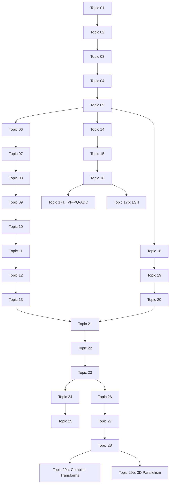

# Curriculum V2 Normalization: Architecture and Splits

## 1. 7-Domain Organization & Topological Prerequisite DAG

- **Domain 1: Tensor representation and numerical kernels** (Topics 01–05)
- **Domain 2: Computation graphs, differentiation, and training mathematics** (Topics 06–13)
- **Domain 3: Retrieval and vector indexing** (Topics 14–17b: 14, 15, 16, 17a IVF-PQ-ADC, 17b LSH)
- **Domain 4: Tokenization and local spatial operators** (Topics 18–20)
- **Domain 5: Model algorithm internals** (Topics 21–23)
- **Domain 6: Inference scheduling and memory** (Topics 24–25)
- **Domain 7: Distributed execution and compiler planning** (Topics 26–29b: 26, 27, 28, 29a Compiler Passes, 29b 3D Parallelism)

### Topological Prerequisite DAG

## 2. Topic 17 Split Execution

- **Topic 17a: Inverted File Index (IVF), Product Quantization (PQ) & Asymmetric Distance Computation (ADC)**
  *Scope:* Space-partitioning indexes, compressing vectors via quantization, and performing approximate distance calculations between uncompressed queries and compressed centroids.
  
- **Topic 17b: Locality-Sensitive Hashing (LSH)**
  *Scope:* Hash-based approximate nearest neighbors, probability collision maximization for similar vectors, random projections, and MinHash.

## 3. Topic 29 Split Execution

- **Topic 29a: Graph Compiler Transforms, Fusion & Memory Planning**
  *Scope:* Tracing/compiling computation graphs, operator fusion, kernel code generation, memory layout optimizations, and ahead-of-time buffer allocation.
  
- **Topic 29b: Tensor, Pipeline & Expert Parallel Algorithms (Megatron-LM & 1F1B)**
  *Scope:* Large-scale model distribution, tensor model parallelism (TP), pipeline parallelism (PP) schedules like 1F1B, and mixture-of-experts (MoE) token routing.
