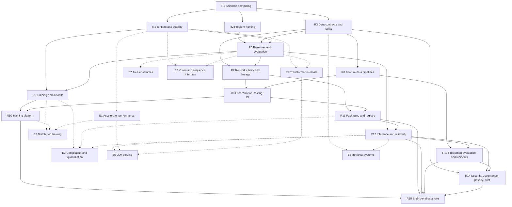

# Target Curriculum and Exact Item Bank

## Design objective

Build a path that lets an experienced software engineer become competent in
production ML infrastructure before choosing a specialist direction.

The path should answer, in order:

1. What prediction or decision should exist, and how will success be measured?
2. What data, labels, representations, and evaluation make that claim valid?
3. How is a model trained reproducibly and turned into a governed artifact?
4. How is that artifact deployed, observed, rolled back, and improved safely?
5. Which performance or model-family specialization does the system require?

## Size recommendation

Use **23 topics and 69 interactive items**:

- 15 required topics × 3 items = 45 required items;
- 8 elective topics × 3 items = 24 elective items.

This is a 70% reduction from the current 232 unique ML-bound definitions while
expanding coverage of the production lifecycle.

Three items per topic is a curriculum constraint, not an arbitrary aesthetic:

1. one item builds or traces the concept;
2. one exposes a failure mode or quantitative tradeoff; and
3. one requires an applied engineering decision in a changed context.

The three items must use at least two assessment modes. A topic cannot be
completed through three near-identical code puzzles. R15 is the intentional
exception: its three capstones use distinct batch-design, real-time-design, and
incident-simulation rubrics rather than smaller interaction modes.

Every item has a review ID formed from its topic and list position: `R4.2`, for
example, is the second item in R4. These are the `target_item_id` values used by
the disposition ledger and source map. Freeze them as stable IDs only after the
bank is ratified; implementation may replace them with semantic kebab-case IDs
to avoid identity changing when presentation order changes.

At an estimated 45–75 minutes per item, the required path represents roughly
34–56 hours of concentrated work. The full standard path represents roughly
52–86 hours. Deep implementation references may remain available outside the
69 assessed milestones.

## Topic graph

### Required spine

| ID | Topic | Prerequisites |
| --- | --- | --- |
| R1 | Python, Environments & Scientific Computing | — |
| R2 | ML Problem Framing & Success Metrics | R1 |
| R3 | Data Contracts, Datasets & Splits | R1 |
| R4 | Numerical Computing, Tensors & Stability | R1 |
| R5 | Baseline Models, Evaluation & Error Analysis | R2, R3, R4 |
| R6 | Training Loops, Autodiff & Optimization | R4, R5 |
| R7 | Experiment Reproducibility, Metadata & Lineage | R3, R5 |
| R8 | Feature/Data Pipelines & Offline–Online Consistency | R3 |
| R9 | ML Workflow Orchestration, Testing & CI | R7, R8 |
| R10 | Training Platform, Compute & Scheduling | R6, R9 |
| R11 | Model Packaging, Registry & Release Promotion | R7, R9 |
| R12 | Inference Deployment & Serving Reliability | R5, R11 |
| R13 | Production Evaluation, Observability & Incident Response | R8, R12 |
| R14 | ML Security, Governance, Privacy & Cost | R3, R12, R13 |
| R15 | End-to-End ML Platform Capstone | R10, R11, R12, R13, R14 |

### Advanced electives

| ID | Topic | Prerequisites |
| --- | --- | --- |
| E1 | Accelerator Performance, Roofline & Kernel Fundamentals | R4 |
| E2 | Distributed Training & Parallelism | R6, R10, E1 |
| E3 | Inference Compilation, Quantization & Portable Runtimes | R6, R11, R12 |
| E4 | Transformer Internals & Tokenization | R4, R5 |
| E5 | LLM Serving Systems | R12, E1, E4 |
| E6 | Retrieval & Vector Data Systems | R3, R12 |
| E7 | Tree-Ensemble Systems | R5 |
| E8 | Vision & Sequence Model Internals | R4, R5 |

Solid edges are the required spine. Dashed edges enter electives. No elective
gates R15.

R1 supports diagnostic credit: a learner who demonstrates Python array
programming and reproducible environment handling can skip its worked examples
and proceed to the changed-context assessment. Generic Git, container,
Kubernetes, API, database, queue, observability, and SRE instruction is not
repeated as separate nodes; those existing skills are reused inside ML-specific
scenarios. ML framing, data semantics, evaluation, and lineage may not be
skipped merely because the learner is senior in ordinary software systems.

## Exact required item bank

The disposition prefix means:

- **retain:** preserve an existing visualizer with minor catalog/content work;
- **merge:** combine several existing definitions into one coherent module;
- **rework:** preserve the core idea but change its goal, claims, or UI; and
- **new:** author a missing production-lifecycle item.

### R1 — Python, Environments & Scientific Computing

1. **New · Debugging:** diagnose a non-reproducible training environment using a
   lockfile, container manifest, native dependency, and accelerator/runtime
   compatibility evidence.
2. **New · Trace visualization:** follow vectors, matrices, basic linear
   operations, broadcasting, NumPy/PyTorch shapes, dtypes, devices, copies, and
   views across an ingestion-to-model boundary.
3. **New · Scenario:** triage determinism across seeds, data-loader worker
   ordering, nondeterministic operations, and environment versions.

Completion evidence: the learner can perform the minimum vector/matrix
reasoning required by a model pipeline and distinguish source reproducibility,
environment reproducibility, and numerical determinism.

### R2 — ML Problem Framing & Success Metrics

1. **New · Scenario:** convert a product goal into a prediction target, decision,
   action, label, and feedback loop; identify when rules are a better choice
   than ML.
2. **New · Calculator:** interpret probabilistic scores and uncertainty; choose
   a metric, decision threshold, cost matrix, and segment-level guardrails for
   an imbalanced problem.
3. **New · Debugging:** find target leakage, label leakage, proxy leakage, and a
   feedback-loop error in a proposed system design.

Completion evidence: the learner can write a falsifiable ML objective and
explain why offline metric improvement may not improve the product decision.

### R3 — Data Contracts, Datasets & Splits

1. **New · Debugging:** validate a dataset against schema, range, nullability,
   freshness, and semantic contracts; classify compatible versus breaking
   changes.
2. **New · Trace visualization:** build time-aware, group-aware
   train/validation/test splits and expose leakage caused by random row splits.
3. **New · Scenario:** construct a lineage graph covering source, transform,
   snapshot, label definition, consent/retention state, and dataset version.

Completion evidence: the learner can reproduce the exact evidence used by a
training run and prevent common split leakage.

### R4 — Numerical Computing, Tensors & Stability

1. **Merge · Trace visualization:** tensor layout, stride, view, reshape,
   contiguity, and offset explorer, based on the strongest current tensor
   visualizers.
2. **Merge · Calculator:** stable softmax and log-sum-exp failure/repair,
   combining overlapping current implementations.
3. **Rework · Scenario:** select dtype and accumulation policy under memory,
   throughput, hardware, overflow, and accuracy constraints.

Completion evidence: the learner predicts shape/layout behavior and recognizes
when numerical stability or implicit conversion invalidates a result.

### R5 — Baseline Models, Evaluation & Error Analysis

1. **New · Scenario:** build and compare a trivial, heuristic, linear, and tree
   baseline; connect loss, estimation, bias/variance, regularization, and
   generalization before approving a more complex model.
2. **New · Calculator:** interpret a confusion matrix, precision/recall,
   threshold curves, calibration, ranking metrics, and slice-level performance.
3. **New · Debugging:** diagnose train/validation divergence, leakage,
   underfitting/overfitting, and distribution shift from evidence.

Completion evidence: the learner can challenge a model-selection claim and
choose evaluation that matches the product decision.

### R6 — Training Loops, Autodiff & Optimization

1. **Retain · Trace visualization:** reverse-mode autodiff over a small
   computational graph, adapted from `micrograd-reverse-gradients`.
2. **Merge · Code completion:** training-loop state across forward pass, loss,
   backward pass, zeroing, optimizer step, gradient accumulation, evaluation
   mode, and checkpoint.
3. **Merge · Calculator:** activation-checkpointing memory/compute tradeoff,
   combining the current checkpointing exercises.

Completion evidence: the learner can explain gradient flow, state mutation, and
the consequences of changing batch/accumulation/checkpoint policies.

### R7 — Experiment Reproducibility, Metadata & Lineage

1. **New · Scenario:** decide what code, data, config, environment, feature,
   metric, and artifact metadata must be recorded to reproduce a run.
2. **New · Trace visualization:** reconstruct a model artifact's ancestry from
   run, dataset, code revision, dependency, and configuration edges.
3. **New · Debugging:** compare two runs and identify confounding changes,
   incomparable metrics, or an invalid causal conclusion.

Completion evidence: the learner can reproduce and audit a model-selection
decision rather than only rerun a script.

### R8 — Feature/Data Pipelines & Offline–Online Consistency

1. **New · Trace visualization:** execute a point-in-time-correct historical
   feature join and contrast it with a leaky join.
2. **New · Debugging:** detect training-serving skew caused by duplicated
   transformations, clock differences, defaults, freshness, or schema changes.
3. **New · Scenario:** select batch, streaming, or hybrid feature
   materialization with an offline/online store plan.

Completion evidence: the learner can keep training evidence and online features
semantically consistent.

### R9 — ML Workflow Orchestration, Testing & CI

1. **New · Trace visualization:** reason through DAG dependencies, artifact
   cache keys, retries, idempotence, partial failure, and backfills.
2. **New · Scenario:** choose unit, data, component, integration, regression,
   and end-to-end tests for a pipeline change.
3. **New · Debugging:** diagnose a failed workflow caused by a stale artifact,
   unsafe retry, mutable input, or incompatible cached output.

Completion evidence: the learner can design a rerunnable pipeline whose tests
cover code, data, and model behavior.

### R10 — Training Platform, Compute & Scheduling

1. **New · Scenario:** choose local, batch, Kubernetes, or managed training
   execution for a workload and organization constraint.
2. **New · Calculator:** size CPU, GPU, memory, storage, network, quota, and
   checkpoint requirements; estimate waste from low utilization.
3. **New · Debugging:** interpret scheduler and workload events for starvation,
   eviction, OOM, quota, topology, data-locality, and checkpoint failures.

Completion evidence: the learner can turn a training requirement into a
reliable, cost-aware execution contract.

### R11 — Model Packaging, Registry & Release Promotion

1. **New · Code completion:** package a model with signature, preprocessing,
   dependencies, runtime contract, metadata, and a deterministic smoke test.
2. **New · Trace visualization:** move immutable versions through candidate,
   approved/champion, deployed, deprecated, and archived registry states.
3. **New · Scenario:** design a promotion gate using quality, compatibility,
   lineage, policy, vulnerability, and reproducibility evidence.

Completion evidence: the learner distinguishes a file store from a governed
artifact registry and can explain every promotion decision.

### R12 — Inference Deployment & Serving Reliability

1. **New · Scenario:** choose batch, asynchronous, online request/response, or
   streaming inference using freshness, latency, volume, and failure semantics.
2. **New · Calculator:** model throughput, concurrency, utilization, queueing,
   p95/p99 latency, replicas, and cost under a stated SLO.
3. **New · Debugging:** diagnose a rollout regression involving schema mismatch,
   cold start, timeout, resource saturation, dependency failure, or bad model.

Completion evidence: the learner can design and operate an inference service
without assuming every model belongs behind a synchronous endpoint.

### R13 — Production Evaluation, Observability & Incident Response

1. **New · Scenario:** separate service health, data quality, model quality,
   fairness/slice, and business-outcome signals with different owners and
   latency.
2. **New · Calculator:** configure drift and performance alerts with delayed
   labels, reference windows, minimum sample sizes, and segment checks.
3. **New · Debugging:** reconstruct an incident timeline and decide among
   rollback, fallback, traffic shift, data repair, retraining, or further
   investigation.

Completion evidence: the learner does not confuse a 200 response with a
correct prediction and does not treat every distribution change as retraining.

### R14 — ML Security, Governance, Privacy & Cost

1. **New · Scenario:** threat-model training data, pipeline credentials,
   feature access, artifacts, model supply chain, and inference endpoints.
2. **New · Debugging:** resolve access-control, retention, deletion, consent,
   redaction, audit, and model-unlearning implications for sensitive data.
3. **New · Calculator:** attribute and budget ingestion, storage, feature,
   training, registry, and inference cost per model/product/tenant.

Completion evidence: the learner can attach controls and ownership to the full
artifact/data lifecycle and justify cost-quality tradeoffs.

### R15 — End-to-End ML Platform Capstone

1. **New · Batch-design capstone:** design a batch prediction product from
   framing and data contract through release, monitoring, and backfill.
2. **New · Real-time-design capstone:** design a real-time prediction system
   with feature consistency, capacity, SLO, canary, rollback, and delayed-label
   evaluation.
3. **New · Incident simulation:** operate a compound drift/data-break incident
   from alert through containment, evidence preservation, remediation, and
   retraining decision.

Completion evidence: a rubric-scored design and incident review that integrates
all required nodes under changed constraints.

## Exact elective item bank

### E1 — Accelerator Performance, Roofline & Kernel Fundamentals

1. **Merge · Calculator:** arithmetic intensity and roofline bound estimator,
   merging current roofline exercises.
2. **Retain · Trace visualization:** naïve versus tiled GEMM memory-access and
   reuse trace, using the strongest current tiling visualizer.
3. **Rework · Scenario:** decide whether kernel optimization is justified from
   an authentic profiler summary and end-to-end bottleneck.

### E2 — Distributed Training & Parallelism

1. **Retain · Trace visualization:** ring all-reduce steps, bytes, overlap, and
   one-rank failure.
2. **Merge · Scenario:** choose data, tensor, and pipeline parallelism under
   model-size, batch, memory, topology, and communication constraints.
3. **Merge · Calculator/debugging:** compute sharded optimizer/gradient/parameter
   memory and diagnose a straggler or communication bottleneck.

### E3 — Inference Compilation, Quantization & Portable Runtimes

1. **Merge · Calculator:** design calibration, per-tensor/per-channel
   quantization, error budget, validation, and rollback.
2. **Rework · Debugging:** identify unsupported operators, graph breaks,
   partition/fusion boundaries, dynamic-shape constraints, and numerical
   regressions.
3. **New · Scenario:** choose portable interchange/runtime versus a
   hardware-specialized engine under compatibility and performance constraints.

### E4 — Transformer Internals & Tokenization

1. **Merge · Trace visualization:** BPE/tokenization behavior, vocabulary
   changes, UTF-8 boundaries, and token-budget effects.
2. **Retain · Trace visualization:** scaled dot-product attention, causal mask,
   head shapes, and output composition.
3. **Merge · Calculator:** KV-cache memory under context length, batch, dtype,
   layers, heads, MQA/GQA, and eviction policy.

### E5 — LLM Serving Systems

1. **Retain · Trace visualization:** paged KV-cache block allocation,
   fragmentation, sharing, and eviction.
2. **Retain · Trace visualization:** continuous batching under mixed arrival
   times, prompt lengths, decode lengths, and cancellation.
3. **Merge · Scenario:** select prefill/decode policy, prefix caching,
   speculative decoding, admission control, overload behavior, and SLO.

### E6 — Retrieval & Vector Data Systems

1. **Retain · Trace visualization:** exact k-NN versus approximate HNSW search.
2. **Merge · Calculator:** choose HNSW, IVF, PQ, filtering, and reranking using
   recall, latency, memory, freshness, and update constraints.
3. **New · Debugging:** diagnose retrieval quality loss caused by embedding
   version, index staleness, chunking, distance choice, or metadata filtering.

### E7 — Tree-Ensemble Systems

1. **Retain · Calculator:** histogram split and gain calculation.
2. **Merge · Scenario:** choose a tree ensemble, linear model, or deep baseline
   based on data, latency, interpretability, update, and deployment constraints.
3. **New · Debugging:** diagnose feature leakage, missingness, or categorical
   encoding mismatch in a tabular pipeline.

### E8 — Vision & Sequence Model Internals

1. **Merge · Trace visualization:** convolution output shape, receptive field,
   lowering/im2col, and memory cost.
2. **Retain/rework · Trace visualization:** recurrent unrolling and
   backpropagation-through-time gradient behavior.
3. **New · Scenario:** select a vision or time-series representation/model
   family under data, accuracy, latency, state, and serving constraints.

## Naming and topic-ID guidance

Implementation should use stable, vendor-neutral topic labels. Suggested IDs
should follow existing kebab-free snake-case style, for example
`ml_problem_framing`, `ml_data_contracts`, `ml_experiment_lineage`, and
`ml_inference_serving`.

Avoid encoding:

- a vendor (`mlflow`, `kubeflow`, `triton`, `vllm`);
- a temporary library version;
- one implementation technique as the entire competency; or
- required/elective ordering in the ID.

Libraries and papers should appear as authentic examples and sources inside an
item. The topic should remain valid when the implementation ecosystem changes.

## Rules for future additions

A proposed 70th item must answer all of these:

1. What distinct competency is not assessed by the existing three items?
2. Why can it not be a variant or changed constraint of an existing item?
3. What production decision or failure becomes safer after learning it?
4. Is the medium appropriate: trace, calculator, debugging, scenario, design,
   code completion, or capstone?
5. Which authoritative source supports the behavior and claims?
6. Does adding it improve the path enough to retire or merge another item?

This creates a quality budget rather than allowing the registry size to become
a proxy for curriculum depth.
